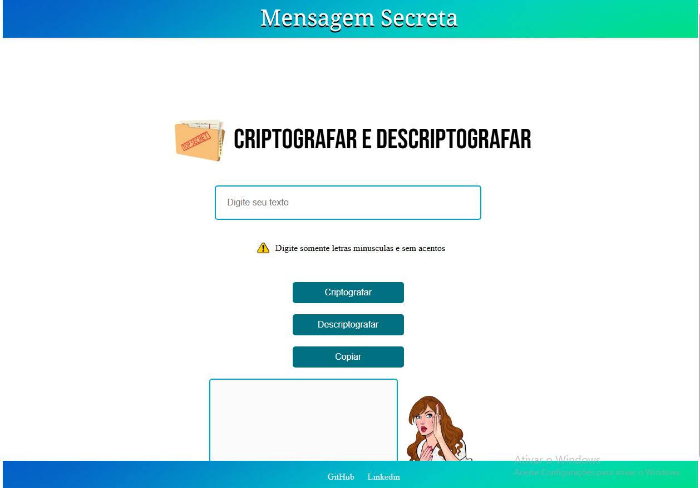

<h1 align="center">🔐 Mensagem Secreta</h1>
  

## 📖 Sobre o Projeto

"Mensagem Secreta" é uma aplicação web divertida e interativa para criptografar e descriptografar mensagens. Com esta ferramenta, você pode facilmente transformar suas mensagens em códigos secretos e compartilhar de maneira segura com seus amigos. O projeto oferece uma forma de enviar mensagens secretas, adicionando um toque de mistério e diversão à comunicação.

## 🛠️ Funcionalidades

- `Criptografar Mensagens`: Converta seu texto comum em uma mensagem codificada usando algoritmos de criptografia.

- `Descriptografar Mensagens`: Decodifique mensagens previamente criptografadas para revelar o texto original.

- `Copiar Texto`: Fácil cópia do texto resultante, seja ele criptografado ou descriptografado, para compartilhar rapidamente.

## 📚 Como Usar

1. **Criptografar uma Mensagem**:
   - Digite a mensagem que deseja criptografar na área de texto fornecida.
   - Clique no botão "Criptografar".
   - A mensagem criptografada aparecerá no campo de saída.
   - Use o botão "Copiar" para copiar a mensagem criptografada.

2. **Descriptografar uma Mensagem**:
   - Cole a mensagem criptografada na área de texto designada.
   - Clique no botão "Descriptografar".
   - A mensagem original aparecerá no campo de saída.
   - Use o botão "Copiar" para copiar a mensagem descriptografada.

## 🔗 Links 

-📌 [GitHub](https://github.com/Izabel-Moreira)

-📌[LinkedIn](https://www.linkedin.com/in/izabel-moreira-corr%C3%AAa-rodrigues/)
